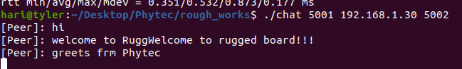
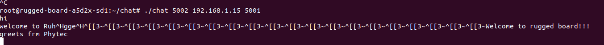
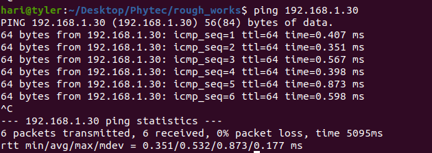
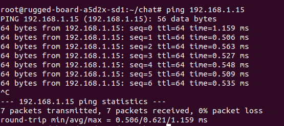

# UDP Chat Application (`chat.c`)

This project implements a simple UDP-based full-duplex chat application written in C using POSIX sockets and multithreading. It supports real-time communication between two peers over a network.

---

## 📸 Screenshots


---

## 📁 Source File

- `chat.c`

---

## 🧰 Requirements

- GCC (C compiler)
- POSIX-compliant system (Linux, Ubuntu, Yocto-based OS)
- Ethernet or Wi-Fi connectivity between devices

---

## 🛠️ Compilation

To compile the source file using `gcc`, run:

```bash
gcc chat.c -o chat -lpthread
```

---

## 🚀 Running the Application

The application requires 3 command-line arguments:

```bash
./chat <your_port> <peer_ip> <peer_port>
```

**Example 1: Run on Host Machine**
```bash
./chat 5002 192.168.1.30 5001

```
**Host Side**



**Example 2: Run on RuggedBoard A5D2X**
```bash
./chat 5001 192.168.1.15 5002
```
**RuggedBoard Side**


Replace the IPs and ports according to your setup.

---

## 🧪 Verifying Network Connection

Before running the application, make sure both devices can communicate using:

```bash
ping <peer_ip>
```

**Example:**

```bash
ping 192.168.1.30   # From host to RuggedBoard

```
**Ping from Host to RuggedBoard**



```bash
ping 192.168.1.30   # From host to RuggedBoard

```
**Ping from RuggedBoard to Host**



## 📦 Features

- Full-duplex UDP communication
- Multi-threaded (input and receive threads)
- Circular buffer for receiving messages
- Linked list queue for sending messages
- Event-driven state machine for control flow

---

## 🧾 Output Example

```
[Peer]: Hello from RuggedBoard!
You: Hi from Host!
```

---

## 📄 License

This project is open-source and distributed under the MIT License.
